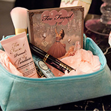
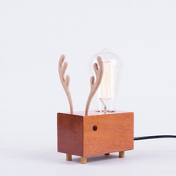
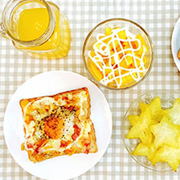
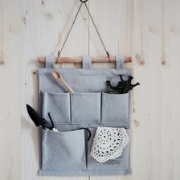
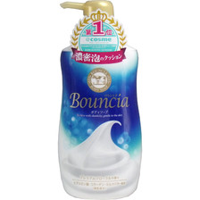

---
---

<!DOCTYPE html>

<html>
<head>
	<meta charset="utf-8">
	<title>堆糖，分享收集生活中的美好，遇见世界上的另外一个你。</title>
	<link rel="stylesheet" type="text/css" href="style/duitang.css"/>
    <link rel="stylesheet" href="font-awesome-4.3.0/css/font-awesome.min.css">
    <link rel="shortcut icon" type="image/x-icon" href="./images/dt-favicon.ico">
</head>
<body>
	

		

			<a href="duitang.css">

</a>
			

				

				    <ul>
					    <li>
						    分类
						    <i></i>
					    </li>
				    </ul>
			    

			    

				    

					<ul>
						<li><a href="#">首页</a></li>
						<li><a href="#">热门</a></li>
						<li><a href="#">最新</a></li>
						<li></li>
						<li><a href="#">良品购</a></li>
						<li><a href="#">特卖惠</a></li>
					</ul>
				    

				    

				    	<ul>
						    <li><a href="#">家居生活</a></li>
						    <li><a href="#">美食菜谱</a></li>
						    <li class><a href="#">婚纱婚礼</a></li>
					    </ul>
					    <ul>
						    <li><a href="#">时尚搭配</a></li>
						    <li><a href="#">美妆造型</a></li>
						    <li><a href="#">手工DIY</a></li>
					    </ul>
					    <ul>
						    <li><a href="#">设计</a></li>
						    <li><a href="#">古风</a></li>
						    <li><a href="#">插画绘画</a></li>
					    </ul>
					    <ul>
						    <li><a href="#">壁纸</a></li>
						    <li><a href="#">头像</a></li>
						    <li><a href="#">文字句子</a></li>
					    </ul>
                         <ul>
						    <li><a href="#">旅行</a></li>
						    <li><a href="#">摄影</a></li>
						    <li><a href="#">人文艺术</a></li>
					    </ul>
					     <ul>
						    <li><a href="#">影音书</a></li>
						    <li><a href="#">人物明星</a></li>
						    <li><a href="#">动画漫画</a></li>
					    </ul>
					     <ul class="ex">
						    <li><a href="#">植物多肉</a></li>
						    <li><a href="#">生活百科</a></li>
						    <li><a href="#">搞笑萌宠</a></li>
					    </ul>
					
				    

				
			    

		    

			

				<form>
					<input class="text" type="text" placeholder="搜索感兴趣的内容" />
					<input class="btn" type="submit" value="">
				</form>
			
	
			

							<a href="#">注册</a>
			

			
<a href="#">登录</a>

			

			    
<a  href="#">关联账号登陆:</a>

			
			    

			    

			    <i></i>
			    

			    	

			    	

			    	

			    

			

			
			
            
			
		

		
	

<!--右侧边栏-->
    

    	

    	

    	

    

<!--主要内容-->
	

		

			

			

				<h3>社区热点</h3>
				

					<ul>
						<li ><a class="ex" href="#">短发</a></li>
						<li><a href="#">看看也好限量版</a></li>
						<li><a href="#">喵星人</a></li>
						<li><a href="#">卖萌文具</a></li>
					</ul>
					<ul>
						<li ><a class="ex" href="#">夏天</a></li>
						<li><a href="#">原创</a></li>
						<li><a href="#">蓝胖子</a></li>
					</ul>
				

				
<h3><a href="#">【活动】记忆里的动画片</a><a class="act yellow" href="#">活动</a></h3>

				
<h3><a href="#">『防晒单品精选』 TOP100</a><a class="act pink" href="#">精选</a></h3>

				
<h3>收图小助手:<a href="#">堆糖收集工具</a></h3>

				
			

			

		

		

			<h3>专辑精选<a href="#">(投稿)</a></h3>
			
往期回顾>

			

			    

				    

				    
<a href="#">用心的菇凉都美了</a>

				    
130个收集 · 13386人喜欢  by lisa-Shali 

			    

			    

		    

		    

			    

				    

				    
<a href="#">双子座星座礼物</a>

				    
100个收集 · 3245人喜欢  by 李大象在哪里 

			    

			    

		    

		    

			    

				    

				    
<a href="#">厨房里的小宇宙</a>

				    
80个收集 · 7369人喜欢  by Kitaro手中的宇宙 

			    

			    

		    

		    

			    

				    

				    
<a href="#">用心的菇凉都美了</a>

				    
130个收集 · 13386人喜欢  by lisa-Shali 

			    

			    

		    

		    

			    

				    

				    
<a href="#">用心的菇凉都美了</a>

				    
130个收集 · 13386人喜欢  by lisa-Shali 

			    

			    

		    

			
		

		

			<h3>专辑精选</h3>
			

				<ul>
					<li>良品购： 全部</li>
					<li>上衣</li>
					<li>裙裤</li>
					<li>配饰</li>
					<li>鞋子</li>
					<li>包袋</li>
					<li>日杂</li>
				</ul>
				
特惠卖>

			

			

			    

				    

				    
<a href="#">通勤包</a>

				    
18248人在逛

				    
<a href="#">良品购</a>

			    

		    

		    

			    

				    

				    
<a href="#">通勤包</a>

				    
18248人在逛

				    
<a href="#">良品购</a>

			    

		    

		    

			    

				    

				    
<a href="#">通勤包</a>

				    
18248人在逛

				    
<a href="#">良品购</a>

			    

		    

		    

			    

				    

				    
<a href="#">通勤包</a>

				    
18248人在逛

				    
<a href="#">良品购</a>

			    

		    

		    

			    

				    

				    
<a href="#">通勤包</a>

				    
18248人在逛

				    
<a href="#">特卖惠</a>

			    

		    

		

		

			<h3>达人推荐</h3>
			
更多达人>

			

			    

				    

				    

				    
<a href="#">curry1</a>

				    

				    	
<i class="fa fa-star"></i>2568

                        
擅长领域：插画，水彩

				    

			    

		    

		    

			    

				    

				    

				    
<a href="#">curry1</a>

				    

				    	
<i class="fa fa-star"></i>2568

                        
擅长领域：插画，水彩

				    

			    

		    

		    

			    

				    

				    

				    
<a href="#">curry1</a>

				    

				    	
<i class="fa fa-star"></i>2568

                        
擅长领域：插画，水彩

				    

			    

		    

		    

			    

				    

				    

				    
<a href="#">curry1</a>

				    

				    	
<i class="fa fa-star"></i>2568

                        
擅长领域：插画，水彩

				    

			    

		    

		    

			    

				    

				    

				    
<a href="#">curry1</a>

				    

				    	
<i class="fa fa-star"></i>2568

                        
擅长领域：插画，水彩

				    

			    

		    

		

	    

	    	<h3>大家正在逛</h3>
	    

	
    

	

		

			

				
关于我们

				<ul>
					<li><a href="#">关于我们</a> <a href="#"> 帮助中心</a> </li>
					<li><a href="#">加入我们</a> <a href="#"> 堆糖手机工具</a> </li>
					<li><a href="#">关于我们</a> <a href="#"> 帮助中心</a> </li>
					<li><a href="#">关于我们</a> <a href="#"> 帮助中心</a> </li>
				</ul>
			

           
			

				
关于我们

				<ul>
					<li><a href="#">关于我们</a> <a href="#"> 帮助中心</a> </li>
					<li><a href="#">关于我们</a> <a href="#"> 帮助中心</a> </li>
				</ul>
			

			

				

				

扫描二维码

下载堆糖手机客户端

				
			

			 

				
关于我们

				<ul>
					<li><a href="#">关于我们</a> <a href="#"> 帮助中心</a> </li>
					<li><a href="#">关于我们</a> <a href="#"> 帮助中心</a> </li>
					<li><a href="#">关于我们</a> <a href="#"> 帮助中心</a> </li>
				</ul>
			

			

				
关于我们

				<ul>
					<li><a href="#">关于我们</a> <a href="#"> 帮助中心</a> </li>
					<li><a href="#">关于我们</a> <a href="#"> 帮助中心</a> </li>
					<li><a href="#">关于我们</a> <a href="#"> 帮助中心</a> </li>
					<li><a href="#">关于我们</a> <a href="#"> 帮助中心</a> </li>
				</ul>
			

		

	

</body>

</html>
